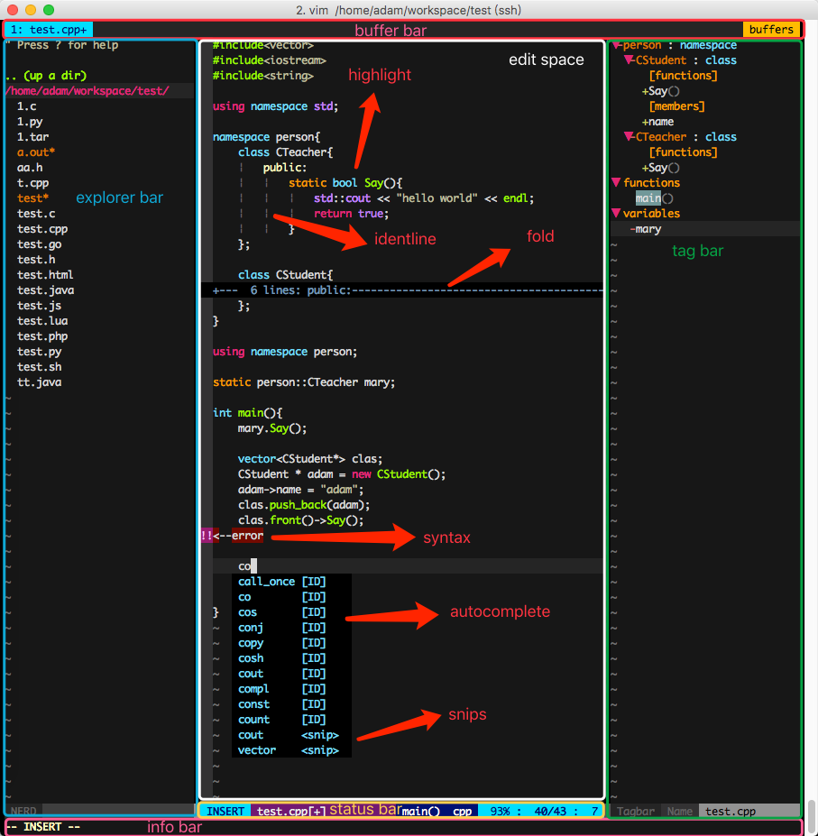

##a simple show

##plugins and resources path
this is a simple and powerful configuration of vim, you can diy your own vim base on it.
you can share some good plugins with me.

|path|info|
|---|---|---|
|~/.vimrc|entrance configuration|
|~/.vim/vim/|vim split configuration |
|~/.vim/vim/base.vim|base configuration|
|~/.vim/vim/plugin.vim|plugins configuration|
|~/.vim/vim/func.vim|function configuration|
|~/.vim/vim/key.vim|key configuration|
|~/.vim/bundle/|plugin installed dir|
|~/.vim/colors/|colorscheme installed dir|
|~/.vim/tags/|tags installed dir|
|~/.vim/UltiSnips/|snips collected dir|
|~/.vim/ycm/|.ycm\_extra\_conf.py dir|
|~/.vim/dicts/|dictionary dir|

##plugin list

|plugin|info|
|---|---|
|[VundleVim/Vundle.vim](https://github.com/VundleVim/Vundle.vim)|plugin manager|
|[asins/vim-dict](https://github.com/asins/vim-dict)|vim key words for many languages|
|[vim-airline/vim-airline](https://github.com/vim-airline/vim-airline)|status bar buffer bar and so on|
|[vim-airline/vim-airline-themes](https://github.com/vim-airline/vim-airline-themes)|airline themes|
|[scrooloose/nerdtree](https://github.com/scrooloose/nerdtree)|folder manager|
|[majutsushi/tagbar](https://github.com/majutsushi/tagbar)|tag explorer|
|[Valloric/YouCompleteMe](https://github.com/Valloric/YouCompleteMe)|powerful code-completion engine|
|[SirVer/ultisnips](https://github.com/SirVer/ultisnips)|ultimate snippet solution for Vim|
|[honza/vim-snippets](https://github.com/honza/vim-snippets)|contains snippets files for various programming languages|
|[fatih/vim-go](https://github.com/fatih/vim-go)|powerful golang engine|
|[jiangmiao/auto-pairs](https://github.com/jiangmiao/auto-pairs)|insert or delete brackets, parens and quotes in pairs|
|[Chiel92/vim-autoformat](https://github.com/Chiel92/vim-autoformat)|format code with one button press|
|[scrooloose/nerdcommenter](https://github.com/scrooloose/nerdcommenter)|comment code with on button press|
|[octol/vim-cpp-enhanced-highlight](https://github.com/octol/vim-cpp-enhanced-highlight)|highlighting key word in C++11/14/17|
|[derekwyatt/vim-fswitch](https://github.com/derekwyatt/vim-fswitch)|switch between .h .hpp and .c .cpp and so on|
|[vim-scripts/DrawIt](https://github.com/vim-scripts/DrawIt)|draw lines in vim|
|[artur-shaik/vim-javacomplete2](https://github.com/artur-shaik/vim-javacomplete2)|java complete engine|
|[scrooloose/syntastic](https://github.com/scrooloose/syntastic)|syntax check for many languages|
|[xolox/vim-misc](https://github.com/xolox/vim-misc)|needed by vim-lua-ftplugin|
|[xolox/vim-lua-ftplugin](https://github.com/xolox/vim-lua-ftplugin)|lua file type plug-in|
|[pangloss/vim-javascript](https://github.com/pangloss/vim-javascript)|syntax highlighting and improved indentation|
|[sentientmachine/erics_vim_syntax_and_color_highlighting](https://github.com/sentientmachine/erics_vim_syntax_and_color_highlighting)|highlight code: java, python, html, javascript, php, css, bash, haml, viml|

##support languages and features (1★=2☆)

|language|highlight|autocomplete|syntax|snips|need improvement|
|---|---|---|---|---|---|
|c|★★☆|★★☆|★★|★★☆|☆|
|cpp|★★☆|★★☆|★★☆|★★☆|☆|
|golang|★★☆|★★☆|★★|★★☆|☆|
|java|★★☆|★★☆|★★|★★☆|★|
|lua|★☆|★☆|☆|★★☆|★☆|
|python|★★|★☆|★★|★★☆|★★|
|javascript|★|★★|☆|★★☆|★★|
|html|★|★|☆|★★☆|★★|
|php|★|★|☆|★★☆|★★|
|...|...|...|...|...|...|

##support keys

|key|info|
|---|---|
|,|leader key|
|,pp|enable/disable paste mode|
|,bb|set fold/unfold all key|
|,ba(or blank)|fold/unfold current block|
|,cc|comment code|
|,cu|uncomment code|
|,uu|switch to next buffer|
|,ub|switch to previous buffer|
|,ll|open nerd tree on left|
|,rr|open tag bar on right|
|,dt|jump to the golang definition|
|,ff|auto format code|
|,sw|switch between .h/.hpp and .c/.cpp/...|
|,cs|cscope find symbols|
|,cg|cscope find defines|
|,ct|cscope find strings|
|,,|cscope jump to next result|
|,.|cscope jump to previous result|
|,ce|cscope close result|
|,yg|ycm GoToDefinitionElseDeclaration|
|,ue|add your own snips|
|,en|jump to next error|
|,ep|jump to previous error|
|,eo|open error list|
|,ee|close error list|
|,tt|add/update your code title|
|...|...|

##install

	git clone https://github.com/adwpc/vim.git
	cd vim
	
	#install new vim to /usr/local/vim if you need
	./ubuntu_install vim
	
	#install vimrc
	./ubuntu_install vimrc
	