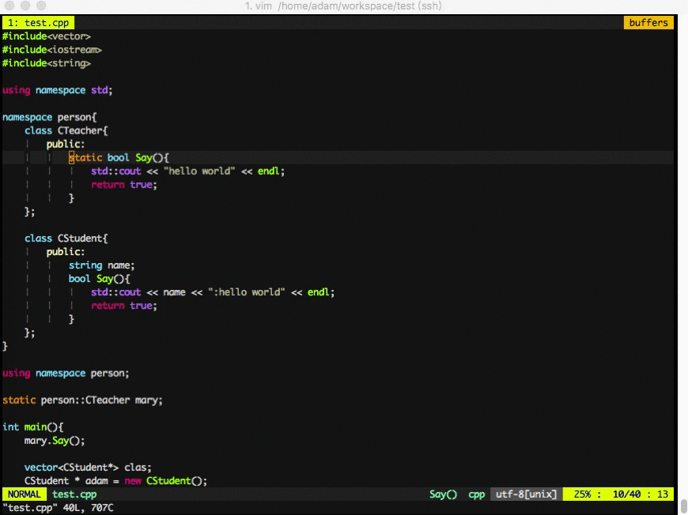

##a simple show

##layout

##support keys (you can diy keys in ~/.vim/vim/key.vim)

|key|info|说明|
|---|---|---|
|,|leader key|前缀键|
|,zi|fold/unfold all code bolcks|整体折叠|
|,za(or blank)|fold/unfold current block|局部折叠|
|//|comment/uncomment code|注释/反注释|
|\<tab\>|switch to next buffer|切换下一缓存|
|\<shift-tab\>|switch to previous buffer|切换前一缓存|
|,ll|open nerd tree on left|打开文件浏览器|
|,rr|open tag bar on right|打开符号浏览器|
|gd|jump to the c-family/golang definition|c系语言/golang跳转到定义|
|,ff|auto format code|自动格式化|
|,fs|cscope find symbols|查找符号|
|,fa|cscope find in interactive|交互查找|
|,ft|cscope find strings|查找字符串|
|\<right\>|cscope jump to next result|跳转到下一结果|
|\<left\>|cscope jump to previous result|跳转到前一结果|
|<|open/close cscope result list|打开/关闭查找结果列表|
|\<down\>|jump to next error|跳转到下一错误|
|\<up\>|jump to previous error|跳转到前一错误|
|>|open/close error list|打开/关闭错误列表|
|,tt|add/update your code title|添加/更新文件说明|
|...|...|...|

##support languages and features (1★=2☆)

|language(语言)|highlight(高亮)|autocomplete(补全)|syntax(查错)|snips(补全块)|todo(待改进)|
|---|---|---|---|---|---|
|c|★★☆|★★☆|★★|★★☆|☆|
|cpp|★★☆|★★☆|★★☆|★★☆|☆|
|golang|★★☆|★★☆|★★|★★☆|☆|
|java|★★☆|★★☆|★★|★★☆|★|
|lua|★☆|★☆|☆|★★☆|★☆|
|python|★★|★☆|★★|★★☆|★★|
|javascript|★|★★|☆|★★☆|★★|
|html|★|★|☆|★★☆|★★|
|php|★|★|☆|★★☆|★★|
|...|...|...|...|...|...|

##plugins and resources path

this is a simple and powerful configuration of vim, you can diy your own vim base on it.
you can share some good plugins with me.

|path|info|
|---|---|---|
|~/.vimrc|entrance configuration|
|~/.vim/vim/|vim split configuration |
|~/.vim/vim/base.vim|base configuration|
|~/.vim/vim/plugin.vim|plugins configuration|
|~/.vim/vim/func.vim|function configuration|
|~/.vim/vim/key.vim|key configuration|
|~/.vim/bundle/|plugin installed dir|
|~/.vim/colors/|colorscheme installed dir|
|~/.vim/tags/|tags installed dir|
|~/.vim/snips/|snips collected dir|
|~/.vim/ycm/|.ycm\_extra\_conf.py dir|
|~/.vim/dicts/|dictionary dir|

##plugin list

|plugin|info|
|---|---|
|[VundleVim/Vundle.vim](https://github.com/VundleVim/Vundle.vim)|plugin manager|
|[asins/vim-dict](https://github.com/asins/vim-dict)|vim key words for many languages|
|[vim-airline/vim-airline](https://github.com/vim-airline/vim-airline)|status bar buffer bar and so on|
|[vim-airline/vim-airline-themes](https://github.com/vim-airline/vim-airline-themes)|airline themes|
|[scrooloose/nerdtree](https://github.com/scrooloose/nerdtree)|folder manager|
|[majutsushi/tagbar](https://github.com/majutsushi/tagbar)|tag explorer|
|[Valloric/YouCompleteMe](https://github.com/Valloric/YouCompleteMe)|powerful code-completion engine|
|[SirVer/ultisnips](https://github.com/SirVer/ultisnips)|ultimate snippet solution for Vim|
|[honza/vim-snippets](https://github.com/honza/vim-snippets)|contains snippets files for various programming languages|
|[fatih/vim-go](https://github.com/fatih/vim-go)|powerful golang engine|
|[jiangmiao/auto-pairs](https://github.com/jiangmiao/auto-pairs)|insert or delete brackets, parens and quotes in pairs|
|[Chiel92/vim-autoformat](https://github.com/Chiel92/vim-autoformat)|format code with one button press|
|[scrooloose/nerdcommenter](https://github.com/scrooloose/nerdcommenter)|comment code with on button press|
|[octol/vim-cpp-enhanced-highlight](https://github.com/octol/vim-cpp-enhanced-highlight)|highlighting key word in C++11/14/17|
|[vim-scripts/DrawIt](https://github.com/vim-scripts/DrawIt)|draw lines in vim|
|[artur-shaik/vim-javacomplete2](https://github.com/artur-shaik/vim-javacomplete2)|java complete engine|
|[vim-syntastic/syntastic](https://github.com/vim-syntastic/syntastic)|syntax check for many languages|
|[xolox/vim-misc](https://github.com/xolox/vim-misc)|needed by vim-lua-ftplugin|
|[xolox/vim-lua-ftplugin](https://github.com/xolox/vim-lua-ftplugin)|lua file type plug-in|
|[pangloss/vim-javascript](https://github.com/pangloss/vim-javascript)|syntax highlighting and improved indentation|
|[sentientmachine/erics_vim_syntax_and_color_highlighting](https://github.com/sentientmachine/erics_vim_syntax_and_color_highlighting)|highlight code: java, python, html, javascript, php, css, bash, haml, viml|
|[Yggdroot/indentLine](https://github.com/Yggdroot/indentLine)|display thin vertical lines for code indented with spaces|
|[xolox/vim-lua-ftplugin](https://github.com/tbastos/vim-lua)|lua highlight|
|[adwpc/cscopex](https://github.com/adwpc/cscopex)|cscope powerful engine|

##install

	git clone https://github.com/adwpc/vim.git
	cd vim
	
	#install vimrc
	./install vimrc
	
    #if you need new vim or some deps, see ./install
    ./install
